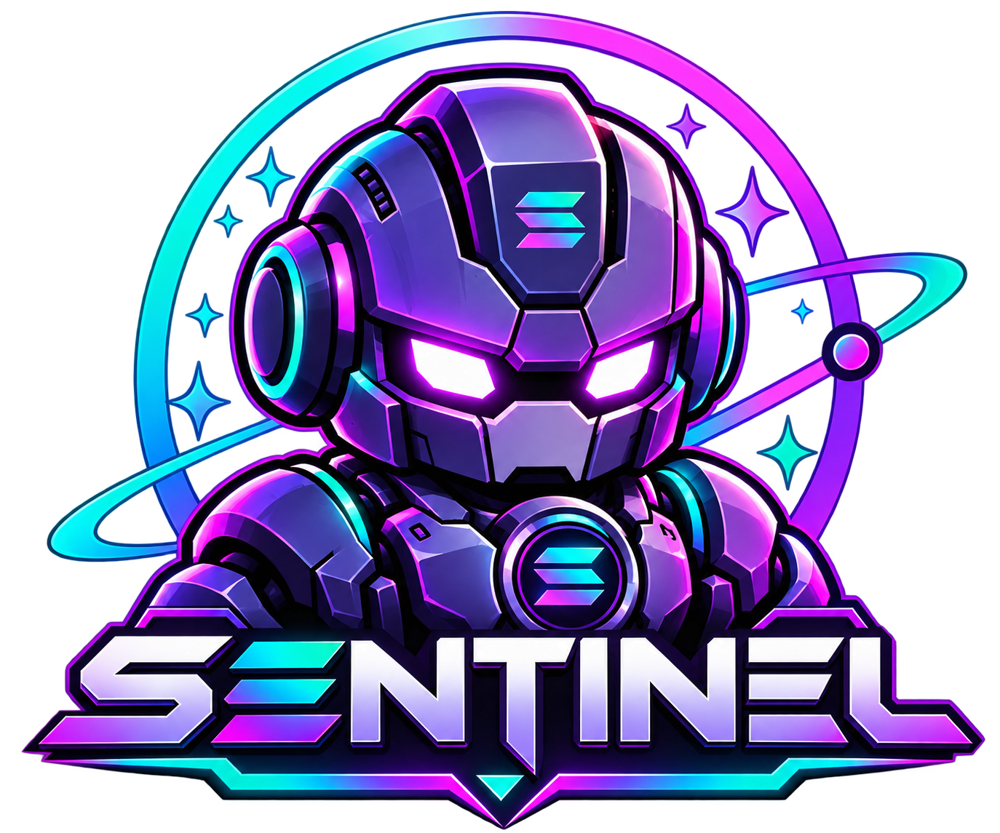

<p align="center">
  
</p>

<h1 align="center">Sentinel Finance — Sentinel Robo</h1>

<p align="center">
  <strong>Outcome-bounded autonomous investing on Solana — deterministic portfolio guarantees for an increasingly autonomous, increasingly fast settlement layer.</strong><br>
  <em>AI agents can decide what to trade. Sentinel decides whether the resulting portfolio state is allowed.</em>
</p>

<p align="center">
  <a href="https://sentinel-finance-production-4560.up.railway.app/"></a>
  <a href="https://explorer.solana.com/address/3gh1Cc2Qc65hJhxZKneXphWJa27z5adyFayc9kWEvAJK?cluster=devnet"></a>
  <a href="https://pyth.network"></a>
  <a href="./docs/SPONSORS.md#2-prestocks-prestocksapiclient--pre-ipo-exposure-ceiling"></a>
  <a href="./docs/SPONSORS.md#3-meteora-meteoradbcmarketqualityverifier--pool-pda-derivation"></a>
  <a href="./docs/VERIFICATION.md"></a>
  <a href="./docs/SECURITY.md"></a>
</p>

<p align="center">
  <code>Agent intent → Promise → Post-state projection → Financial invariants → Block / Settle → Adapt → Cryptographic evidence</code>
</p>

<p align="center">
  <a href="https://sentinel-finance-production-4560.up.railway.app/">Live Hosted App</a> ·
  <a href="./docs/TECHNICAL.md">Technical Docs</a> ·
  <a href="./docs/DEMO.md">Demo Walkthrough</a> ·
  <a href="https://explorer.solana.com/address/3gh1Cc2Qc65hJhxZKneXphWJa27z5adyFayc9kWEvAJK?cluster=devnet">Solana Explorer</a> ·
  <a href="./docs/VERIFICATION.md">Verification Gate</a> ·
  <a href="./docs/SECURITY.md">Security Matrix</a> ·
  <a href="./docs/SPONSORS.md">Sponsor Integrations</a>
</p>

---

## The 30-Second Demo

`Robo-01` proposes:
`BUY NVDAx $15,000`

Sentinel projects post-state invariants:
```text
NVDAx    20% → 35%      LIMIT 25%   ✕
USDC     25% → 10%      MIN   20%   ✕
Trade    —   → $15K     MAX   $10K  ✕
```
**`✕ BLOCKED`** — Transaction reverts before capital moves ([Devnet TX `2haBLUK...`](https://explorer.solana.com/tx/2haBLUKavXYzqa6nTtDMNaNNUu4ax5rqSnYmQKMAxCwJeqzaUw4tPSSMtDdynbWjqSW32EgqmHxaeHj4eGWsTjCD?cluster=devnet)).

`Robo-01` reads the structured rejection, recalculates exact compliant headroom, and adapts to:
`BUY NVDAx $5,000` (`NVDAx 20% → 25.0%`, `USDC 25% → 20.0%`).

**`✓ APPROVED & SETTLED`** — Sentinel's on-chain `VaultAccount` state transition commits on Solana Devnet with a PROVN SHA-256 receipt ([Devnet TX `59KCBronda...`](https://explorer.solana.com/tx/59KCBrondaKxhKmTqeib4cMGFZRh1mRQW815GUeazmAK5PYwD3Vomy957XreERfXmsLQKDc3XibcjURPnWJVmqUd?cluster=devnet)). No external Meteora/PreStocks DEX swap is performed in the current Devnet build.

---

## Real on Devnet vs. Demo / Simulation

To provide complete technical transparency for judges, code auditors, and reviewers:

| Dimension | Real On Solana Devnet (Authoritative) | Interactive Demo / Simulation Layer |
| :--- | :--- | :--- |
| **Anchor Program** | Deployed Solana program (`3gh1Cc2Q...`) enforcing `execute_guarded_trade` atomic postconditions | Client-side what-if projection simulator on Overview |
| **Account State** | On-chain `PolicyAccount`, `AgentAccount`, `VaultAccount`, `PromiseAccount`, `EvidenceAccount` PDAs | Simulated preview headroom calculations |
| **Policy Updates** | Signed by user's browser wallet (Phantom/Solflare) committing on Devnet RPC via Anchor | Local UI candidate state prior to on-chain signing |
| **Flagship Rejection** | Real rejected $15K Devnet transaction ([TX `2haBLUK...`](https://explorer.solana.com/tx/2haBLUKavXYzqa6nTtDMNaNNUu4ax5rqSnYmQKMAxCwJeqzaUw4tPSSMtDdynbWjqSW32EgqmHxaeHj4eGWsTjCD?cluster=devnet)) | Preflight client-side rejection preview |
| **Flagship Settlement** | Real $5K guarded `VaultAccount` state transition ([TX `59KCBronda...`](https://explorer.solana.com/tx/59KCBrondaKxhKmTqeib4cMGFZRh1mRQW815GUeazmAK5PYwD3Vomy957XreERfXmsLQKDc3XibcjURPnWJVmqUd?cluster=devnet)) | Target allocation slider projection curves |
| **Evidence Proofs** | PROVN SHA-256 on-chain evidence transaction ([TX `3pvsnpVZ...`](https://explorer.solana.com/tx/3pvsnpVZ7A2f2ESd8jeHjbMbTYFsPv7g7RstKnNzBRpiR4mdUtCkQY5RQEPSb1fL8934sArLRp9KRDNXzFfT19Lw?cluster=devnet)) | Two-tier evidence receipt inspection drawer |
| **Price Feeds** | Pyth Hermes v2 sub-second price streaming in `LIVE` mode (`https://hermes.pyth.network`) | Injected 140s stale-quote demo scenario |
| **Sponsor Scenarios** | Meteora DBC deterministic pool PDA derivations; PreStocks 409A NAV normalization | Simulated shallow DBC pool impact (`1.7% > 1.0%`) & $30K OPENAIx breach |
| **LLM Provider** | OpenAI GPT-4o function-calling supported when `OPENAI_API_KEY` is configured | Deterministic `DemoProvider` running on the hosted deployment |
| **Persistence** | Railway Managed PostgreSQL read model (`agent_runs`, `decisions`, `executions`, `evidence_index`) | In-memory read model fallback when running locally without a database |

---

## Three Failure Modes Sentinel Enforces

| Threat | Example Trigger | Sentinel Outcome |
| :--- | :--- | :--- |
| **1. Untrusted Agent** | `BUY $15K NVDAx` (`35% > 25%` cap, `USDC 10% < 20%` floor) or `BUY $30K OPENAIx` (`Pre-IPO > 20%`) | Atomically blocked (`ERR_CONCENTRATION_LIMIT` / `ERR_PRE_IPO_EXPOSURE`); agent adapts to exact headroom (`$5K` / `$2K`). |
| **2. Untrusted Data** | Pyth oracle quote is stale (`140s > 60s`) or Hermes is unreachable in `LIVE` mode | Fail-closed (`ERR_QUOTE_STALE` / `NO EXECUTION`); never falls back to synthetic prices in `DEVNET LIVE`. |
| **3. Untrusted Market** | Meteora DBC pool depth is shallow (`$12K < $25K` floor) or spread exceeds `200 bps` | Blocked pre-execution by `LiquidityVerifier` (`MARKET_QUALITY_FAILURE`). |

---

## Architecture (`CURRENT DEVNET` vs. `TARGET ARCHITECTURE`)

```text
                        ┌─────────────────────────────┐
                        │     SENTINEL WEB (Docker)   │
                        │  Next.js 15 UI + BFF API    │
                        │  @sentinel/sdk & @domain    │
                        └──────┬───────────────┬──────┘
                                │               │
           SOLANA_RPC_URL       ▼               ▼       DATABASE_URL
    ┌───────────────────────────────┐       ┌───────────────────────────────┐
    │      SOLANA DEVNET (TRUTH)    │       │   POSTGRESQL (READ HISTORY)   │
    │  Program: 3gh1Cc...WEvAJK     │       │  1. agent_runs                │
    │  • PolicyAccount PDA          │       │  2. decisions                 │
    │  • AgentAccount PDA           │       │  3. executions                │
    │  • VaultAccount PDA           │       │  4. portfolio_snapshots       │
    │  • PromiseAccount PDA         │       │  5. evidence_index            │
    │  • EvidenceAccount PDA        │       └───────────────────────────────┘
    └───────────────────────────────┘
```

- **`CURRENT DEVNET` (Implemented & Live)**:
  - Browser wallet signs `PolicyAccount` PDA updates (`POST /api/policy/:wallet` prepares unsigned Anchor tx; server never signs user policy changes).
  - `PythLivePriceProvider` queries Pyth Hermes v2 (`https://hermes.pyth.network`); `PreStocksApiClient` normalizes Pre-IPO NAVs server-side; `MeteoraDBCMarketQualityVerifier` validates deterministic pool PDAs pre-trade.
  - Anchor `execute_guarded_trade` verifies postconditions on-chain and mutates `VaultAccount` + `PromiseAccount` state on Solana Devnet, followed by `record_evidence` (`EvidenceAccount` PDA).
  - Current Devnet settlement mutates Sentinel's `VaultAccount` ledger on-chain; it does **not** perform an external DEX swap CPI into a Meteora pool on Devnet.
- **`TARGET ARCHITECTURE` (Post-Hackathon Roadmap)**:
  - Direct on-chain Cross-Program Invocation (CPI) from Sentinel `execute_guarded_trade` into Meteora DBC / PreStocks secondary liquidity pools with post-CPI SPL token vault balance assertions.

---

## Built for Solana's Next Consensus Era

Sentinel is an application-layer enforcement system: the agent proposes, Sentinel evaluates the projected portfolio state, and the on-chain Solana program enforces the resulting constraints.

Solana's upcoming **Alpenglow** consensus upgrade targets sub-second (~150 ms) finality while leaving SVM transaction execution unchanged. Sentinel does not depend on Alpenglow today, but its policy-bound execution model is designed to benefit from Solana's continued improvements in confirmation and finality.

```text
Agent Intelligence ➔ Sentinel Policy Postconditions ➔ SVM Execution ➔ Solana Consensus / Finality ➔ PROVN Evidence Index
```

- **Today:** Sentinel runs on Solana Devnet with real on-chain policy enforcement (`execute_guarded_trade`), state transitions on `VaultAccount` PDAs, and PROVN cryptographic evidence.
- **Direction:** Faster consensus + autonomous agents + deterministic financial postconditions. The consensus layer can evolve underneath the Sentinel enforcement model without requiring redesign of the core policy logic.

---

## What's Real on Devnet

| Artifact | On-Chain Address / Signature | Explorer |
| :--- | :--- | :--- |
| **Sentinel Anchor Program** | `3gh1Cc2Qc65hJhxZKneXphWJa27z5adyFayc9kWEvAJK` | [Program](https://explorer.solana.com/address/3gh1Cc2Qc65hJhxZKneXphWJa27z5adyFayc9kWEvAJK?cluster=devnet) |
| **Live Railway Deployment** | `sentinel-finance-production-4560.up.railway.app` | [Live Production App](https://sentinel-finance-production-4560.up.railway.app/) |
| **PolicyAccount PDA** | `3wTp1YDSG3xmf9TtuwZ64b11uLuLNUgQRwdesMbFJUUh` | [Policy PDA](https://explorer.solana.com/address/3wTp1YDSG3xmf9TtuwZ64b11uLuLNUgQRwdesMbFJUUh?cluster=devnet) |
| **AgentAccount PDA (`robo-01`)** | `62vpHzSG92GUbAXtNh4czG6U6HyTpndrY4NvZM9euUnQ` | [Agent PDA](https://explorer.solana.com/address/62vpHzSG92GUbAXtNh4czG6U6HyTpndrY4NvZM9euUnQ?cluster=devnet) |
| **VaultAccount PDA** | `7TffMKzUgVme4eod8Wh9ANAQ3YrRMzj4c2JrfKm6AY4Y` | [Vault PDA](https://explorer.solana.com/address/7TffMKzUgVme4eod8Wh9ANAQ3YrRMzj4c2JrfKm6AY4Y?cluster=devnet) |
| **Rejected `$15K` Trade Proof TX** | `2haBLUKavXYzqa6nTtDMNaNNUu4ax5rqSnYmQKMAxCwJeqzaUw4tPSSMtDdynbWjqSW32EgqmHxaeHj4eGWsTjCD` | [View TX](https://explorer.solana.com/tx/2haBLUKavXYzqa6nTtDMNaNNUu4ax5rqSnYmQKMAxCwJeqzaUw4tPSSMtDdynbWjqSW32EgqmHxaeHj4eGWsTjCD?cluster=devnet) |
| **Settled `$5K` Adapted Trade TX** | `59KCBrondaKxhKmTqeib4cMGFZRh1mRQW815GUeazmAK5PYwD3Vomy957XreERfXmsLQKDc3XibcjURPnWJVmqUd` | [View TX](https://explorer.solana.com/tx/59KCBrondaKxhKmTqeib4cMGFZRh1mRQW815GUeazmAK5PYwD3Vomy957XreERfXmsLQKDc3XibcjURPnWJVmqUd?cluster=devnet) |
| **PROVN Evidence Anchor TX** | `3pvsnpVZ7A2f2ESd8jeHjbMbTYFsPv7g7RstKnNzBRpiR4mdUtCkQY5RQEPSb1fL8934sArLRp9KRDNXzFfT19Lw` | [View TX](https://explorer.solana.com/tx/3pvsnpVZ7A2f2ESd8jeHjbMbTYFsPv7g7RstKnNzBRpiR4mdUtCkQY5RQEPSb1fL8934sArLRp9KRDNXzFfT19Lw?cluster=devnet) |

---

## Sponsor Integrations

| Sponsor | Integration Summary | Deep Dive |
| :--- | :--- | :--- |
| **Pyth Network** | `PythLivePriceProvider` fetches live Hermes v2 prices/confidence/age (`NVDAx`/`NVDA`, `AAPLx`/`AAPL`, `SPYx`/`SPY`) and enforces fail-closed staleness (`≤ 60s`) & dual-feed peg deviation (`≤ 100 bps`) guards. | [docs/SPONSORS.md](./docs/SPONSORS.md#1-pyth-network-pythlivepriceprovider--dual-feed-tracking) |
| **PreStocks** | Server-side `PreStocksApiClient` normalizes certified Pre-IPO assets (`OPENAIx`, `SPACEXx`, `STRIPEx`, `ANTHROPICx`) into an isolated universe and enforces the `Pre-IPO ≤ 20%` portfolio exposure ceiling. | [docs/SPONSORS.md](./docs/SPONSORS.md#2-prestocks-prestocksapiclient--pre-ipo-exposure-ceiling) |
| **Meteora** | Derives canonical Meteora DBC pool PDAs (`4bHACh...`) and verifies pool liquidity depth (`≥ $25,000`) and price impact (`≤ 200 bps`) before Sentinel authorizes execution. *(Note: Devnet settlement occurs on the Sentinel VaultAccount after pre-trade Meteora verification rather than an on-chain Meteora swap CPI).* | [docs/SPONSORS.md](./docs/SPONSORS.md#3-meteora-meteoradbcmarketqualityverifier--pool-pda-derivation) |

---

## Tech Stack & Quick Start

- **On-Chain**: Rust, Anchor (`0.30.1`), Solana Web3.js (`@solana/web3.js`).
- **Packages**: `@sentinel/domain` (policy/valuation/PROVN), `@sentinel/sdk` (agent loop, LLM tool dispatcher, adapters), `@sentinel/web` (Next.js 15.5.25 App Router, Tailwind CSS, PostgreSQL `pg` read model).
- **AI Integration**: OpenAI GPT-4o supported; hosted deployment currently runs `DemoProvider` deterministic fallback unless `OPENAI_API_KEY` is configured.
- **Docker Image**: Multi-arch (`linux/amd64` + `linux/arm64`) image published at [`darshan712/sentinel-finance:latest`](https://hub.docker.com/r/darshan712/sentinel-finance).
- **Live Railway Deployment**: [`https://sentinel-finance-production-4560.up.railway.app/`](https://sentinel-finance-production-4560.up.railway.app/) (Production Next.js 15.5.25 + Managed PostgreSQL 16 read model + Solana Devnet + Pyth Hermes dual feeds).

```bash
# 1. Install, build, and run locally
pnpm install && pnpm build
pnpm --filter @sentinel/web dev

# 2. Or run the canonical single-container Docker deployment (+ optional Postgres)
cp .env.example .env
docker compose up --build -d
curl http://localhost:3000/api/health
```

---

## Testing & Verification (`144 Automated Tests Passing + Solana Devnet Gate`)

```bash
# Run all 144 unit, domain, SDK, and 11-vector adversarial security tests
pnpm test

# Run live Solana Devnet P22/P23 verification gate
node packages/sdk/scripts/verify-p22-p23-devnet.mjs
```

---

## Documentation Links

- [Live Production Deployment (Railway)](https://sentinel-finance-production-4560.up.railway.app/)
- [Technical Architecture & Anchor Lifecycle](./docs/TECHNICAL.md)
- [Sponsor Integrations (`Pyth`, `PreStocks`, `Meteora`)](./docs/SPONSORS.md)
- [Flagship Demo & Narration Guide](./docs/DEMO.md)
- [11-Vector Adversarial Security Matrix](./docs/SECURITY.md)
- [Full Devnet Verification Gate & Proofs](./docs/VERIFICATION.md)
